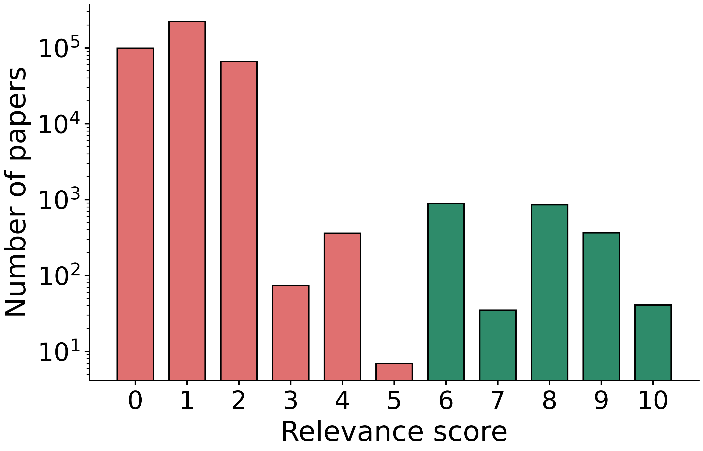
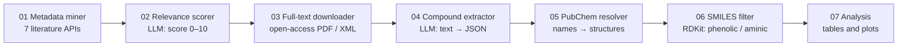

# llm-literature-mining

A pipeline that uses a **locally hosted large language model** to read the scientific
literature at scale and pull out the antioxidant additives used in lubricants. It
harvests paper metadata from seven literature APIs, has an LLM score every paper for
relevance, has the LLM extract named compounds from the relevant papers as structured
JSON, and turns those names into chemical structures that can be filtered and analyzed.

Everything runs on open-weight models (Llama 3, Qwen, or any model served by
[Ollama](https://ollama.com)) on university GPU nodes under SLURM. No paid LLM API is used.

## At a glance

| | |
|---|---|
| Records harvested from 7 literature APIs | 1.54 million |
| Unique papers scored for relevance by the LLM (0–10) | **392,289** |
| Papers kept as relevant (score ≥ 6) | 2,188 |
| Papers read by the LLM for compound extraction | 5,524 (3,338 full texts, 2,186 abstracts) |
| Antioxidant mentions extracted as structured JSON | 20,763 (9,125 unique names) |
| Unique chemical structures after PubChem resolution | 556, including 172 phenolic and 34 aminic antioxidants |
| Model used for the full runs | Llama 3 8B (4-bit) on NVIDIA L40S GPUs; also tested with Llama 3 70B and Qwen 3 30B |

<p align="center">
  
</p>

*LLM relevance scores for all 392,289 papers (log scale). The model was asked how closely each
title and abstract relates to antioxidant additives for lubricants. Green bars (score ≥ 6, 2,188
papers) were passed on to compound extraction; red bars were filtered out. Most of the corpus
scores 0–2, which is the point of the step: a keyword search returns hundreds of thousands of
papers, and the LLM narrows them to the few thousand worth reading.*

### What this project shows

- **LLM inference at scale on HPC.** Ollama servers launched inside SLURM GPU jobs, several
  servers per GPU for throughput, and checkpoint/resume so multi-day jobs survive restarts.
- **Prompting for structured output.** JSON-only prompts at low temperature, explicit rules
  against inventing structures ("give a SMILES only if it is written in the text"), and
  tolerant parsing with retries.
- **Long documents with a short context window.** Papers are split into overlapping chunks
  sized to the model, and results are merged per paper (see
  [Chunking and context windows](#chunking-and-context-windows)).
- **Data engineering.** Seven APIs (OpenAlex, Semantic Scholar, Crossref, PubMed, Europe PMC,
  CORE, Lens) with per-source rate limits and query translation, then deduplication by DOI
  and title.
- **Cheminformatics.** Name-to-structure resolution through PubChem, RDKit substructure
  classification, and chemical-space plots (PCA, t-SNE, UMAP).

## Pipeline



| Step | Folder | What it does | Uses the LLM |
|---|---|---|---|
| 1 | [`01-metadata-miner`](01-metadata-miner) | Queries 7 APIs with 27 search intents and deduplicates the results | |
| 2 | [`02-relevance-scorer`](02-relevance-scorer) | Scores each title and abstract 0–10 for relevance | ✓ |
| 3 | [`03-fulltext-downloader`](03-fulltext-downloader) | Finds open-access full texts (PMC, Europe PMC, Unpaywall, Semantic Scholar, CORE) and extracts clean text | |
| 4 | [`04-compound-extractor`](04-compound-extractor) | Chunks each paper and extracts named antioxidant additives as JSON | ✓ |
| 5 | [`05-pubchem-resolver`](05-pubchem-resolver) | Resolves compound names and abbreviations to PubChem IDs and SMILES | |
| 6 | [`06-smiles-filter`](06-smiles-filter) | Classifies structures as phenolic, aminic, or other with RDKit | |
| 7 | [`07-analysis`](07-analysis) | Summary tables and chemical-space plots | |

Each step writes to its own `output/` folder, and the next step reads from there.

## Choosing a model: Llama 3 8B, 70B, or another open model

The model is a setting, not part of the code. Set `LLM_MODEL` in `.env`, pass it with
`sbatch --export`, or use `--model` on steps 02 and 04. Any chat model in the
[Ollama library](https://ollama.com/library) can be used, for example Qwen 2.5 / Qwen 3,
Llama 3.1 / 3.3, Mistral, or Gemma. Output quality differs between models, so check a new
model on a few papers with `llm/demo.py` before a full run.

| Model | Context window | GPU memory (measured) | Settings |
|---|---|---|---|
| `llama3:8b` | 8K tokens | 6 GB | Default; used for the full runs, with 4 Ollama servers sharing one GPU |
| `llama3:70b` | 8K tokens | 41 GB, fits one 48 GB GPU | `OLLAMA_SERVERS=1` for step 04 |
| `qwen3:30b-a3b` | 256K tokens (Ollama loads 32K by default) | 21 GB | `LLM_THINK=false`, `LLM_FORCE_JSON=true` |

Qwen 3 is a reasoning model: by default it "thinks" in text before answering, which uses
up the short answer budget of step 02. `LLM_THINK=false` turns that off and
`LLM_FORCE_JSON=true` makes Ollama constrain the answer to the expected JSON. Other
reasoning models (for example DeepSeek-R1) need the same two settings.

Output of `llm/demo.py` on an NVIDIA L40S GPU. Each model scored the abstract of a
lubricant-antioxidant paper and a food-science abstract, then extracted compounds from a
sample paragraph that names three lubricant antioxidants and vitamin E (which should be
excluded):

| Model | Lubricant paper | Food-science paper | Compounds extracted |
|---|---|---|---|
| Llama 3 8B | 9 | 2 | the 3 antioxidants |
| Llama 3 70B | 10 | 4 | the 3 antioxidants |
| Qwen 3 30B-A3B | 9 | 2 | the 3 antioxidants, plus their abbreviations BHT and PANA as separate entries |

```bash
# Demo: score two example papers and extract compounds from a sample paragraph
sbatch llm/demo.slurm                                                     # Llama 3 8B
sbatch --mem=64G --export=ALL,LLM_MODEL=llama3:70b llm/demo.slurm         # Llama 3 70B
sbatch --export=ALL,LLM_MODEL=qwen3:30b-a3b,LLM_THINK=false,LLM_FORCE_JSON=true llm/demo.slurm

# Full relevance scoring with Llama 3 70B
cd 02-relevance-scorer
sbatch --export=ALL,LLM_MODEL=llama3:70b submit.sh

# Compound extraction with Llama 3 70B (one Ollama server per GPU)
cd 04-compound-extractor
sbatch --export=ALL,LLM_MODEL=llama3:70b,OLLAMA_SERVERS=1 submit.sh
```

## Chunking and context windows

An LLM can only read as much text at once as its **context window** allows, and the prompt
and the model's answer have to fit in the same window. Llama 3 (8B and 70B) has an
**8,192-token** window, roughly 30,000 characters. That is shorter than most papers. In
this corpus the median full text is about 29,000 characters (~7,400 tokens) and one in
ten is longer than 56,000 characters (~14,000 tokens). Only 37% of the papers would fit
in one Llama 3 call with room left for the prompt and answer.

So step 04 **chunks** each paper:

- the text is split into pieces of at most 10,000 characters (~2,500 tokens), breaking at
  paragraph or sentence boundaries;
- consecutive chunks overlap by 800 characters, so a compound mentioned across a boundary
  is not lost;
- each chunk gets its own LLM call, and the compounds found in all chunks of a paper are
  merged and deduplicated by name.

A median paper becomes 4 chunks, which costs 4 LLM calls instead of 1, and the model never
sees the whole paper at once.

**Long-context models do not need chunking for most papers.** Qwen 2.5 and Qwen 3 accept
32K tokens or more, and Llama 3.1 and later accept 128K. With a 32K window, 99% of the
papers in this corpus fit in a single call. To send whole papers, raise the chunk size and
ask Ollama for the larger window:

```bash
# .env, or sbatch --export
LLM_MODEL=qwen3:30b-a3b
LLM_THINK=false
LLM_NUM_CTX=32768     # explicit, so the window does not depend on Ollama's default
CHUNK_CHARS=100000    # one chunk for nearly every paper
OLLAMA_SERVERS=1
```

Then delete `04-compound-extractor/output/chunks/` so the chunk cache is rebuilt. Two
trade-offs: a longer context uses more GPU memory and makes each call slower, and models
can miss details buried in the middle of very long inputs. Comparing chunked and
whole-paper extraction on a sample of papers is a quick way to choose.

## Getting started

Requirements: Python 3.10+, [Ollama](https://ollama.com), and an NVIDIA GPU for the LLM
steps (the other steps run on CPU).

```bash
git clone https://github.com/sahmed73/llm-literature-mining.git
cd llm-literature-mining
pip install -r requirements.txt        # or a conda / micromamba environment
cp .env.example .env                   # contact email, optional API keys, model choice

ollama pull llama3:8b
ollama serve &
python llm/demo.py --model llama3:8b   # quick check that the model and prompts work
```

To run the whole pipeline, go through the folders in order and run `python main.py`, or
`sbatch submit.sh` on a SLURM cluster. The SLURM scripts load `.env` automatically and use
the `pi.amartini` partition of the UC Merced cluster; change the `#SBATCH` lines for
yours. Step 04 reads papers from `PAPERS_DIR`, which can be step 03's downloads or an
export from a reference manager.

## Data

The repository contains code only. Paper PDFs and full texts belong to their publishers
and are not redistributed, and the pipeline outputs (about 15 GB) are not included; the
code regenerates them. The example abstract in `llm/demo.py` is from my own open-access
paper (CC BY 4.0).

## Author

**Shihab Ahmed**, PhD candidate in Mechanical Engineering, University of California, Merced.
Website: [sahmed73.github.io](https://sahmed73.github.io)

Developed as part of my PhD research on antioxidant additives for lubricants.

## License

[MIT](LICENSE)
